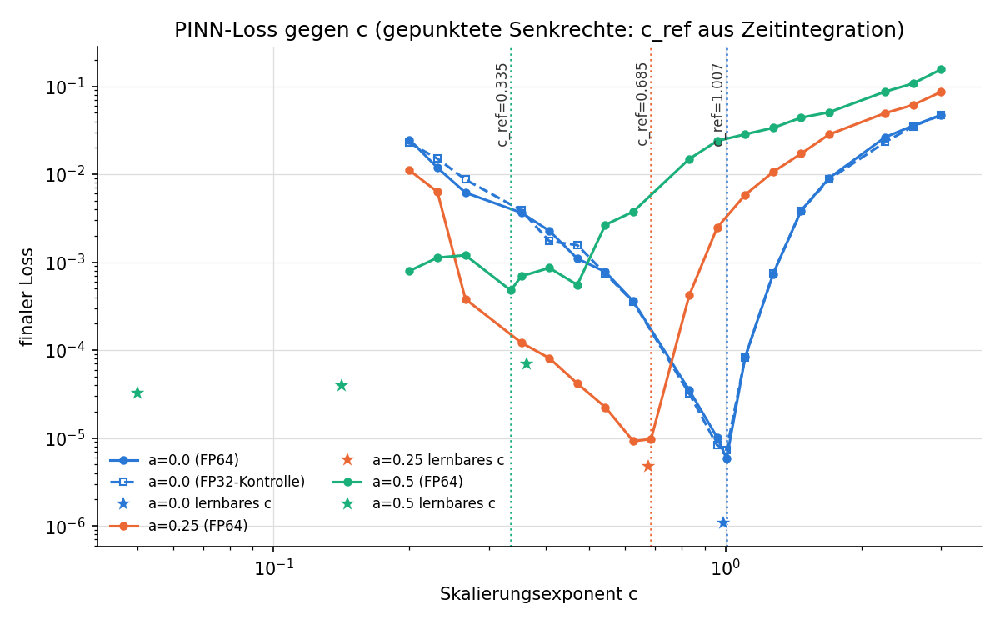
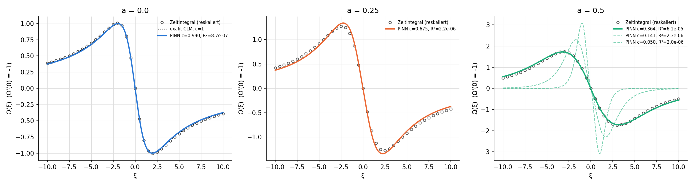

# gCLM blow-up profiles with a PINN

Can a physics-informed neural network (PINN) in self-similar coordinates find the
blow-up profiles of the generalized Constantin–Lax–Majda (gCLM) model? This
includes unstable profiles. How does success depend on the advection parameter `a`?

**Short answer:** The PINN recovers the stable profile cleanly at `a = 0`. At
`a = 0.25` it misses one of the two criteria by a small margin, and at `a = 0.5` it
fails. It found no credible unstable profile. The method stops working before
the unstable profiles become reachable.

## Context

Whether smooth solutions of the 3D Euler and Navier–Stokes equations can blow up
in finite time is a central open question in fluid mechanics. One line of work
computes self-similar blow-up profiles numerically, increasingly with
physics-informed neural networks: a smooth self-similar profile for the
Boussinesq and axisymmetric 3D Euler equations with a boundary, and an unstable
profile for the Córdoba–Córdoba–Fontelos equation [1]; with high-precision
Gauss–Newton training, families of unstable profiles followed [2]. In September
2026 OpenAI announced a Lean-formalised proof of finite-time blow-up for the 3D
Navier–Stokes equations with a smooth external force [3]. As reported, that
construction rests on a cascade mechanism going back to Martínez-Zoroa and
Córdoba, not on a numerically computed self-similar profile; this project does
not build on it.

This project works at the bottom of that ladder. The generalized
Constantin–Lax–Majda (gCLM) model [4, 5] is a one-dimensional model of vortex
stretching in which the questions above can be checked against known answers.
Exact self-similar solutions exist at `a = 0` [4, 6] and `a = 1/2` [6, 7], with
scaling exponents `c = 1` and `c = 1/3`. Self-similar profiles are proven to
exist for all `a ≤ 1` [8]. Below `a_c ≈ 0.689` they are smooth and decay
algebraically, `|Ω| ~ |ξ|^(−1/c)` [6], which is the far-field form used here.
The project measures what a small PINN on one T4 can and cannot recover in this
setting, before the expensive high-precision methods become necessary.

## Problem

gCLM on the real line [4, 5]:

```
ω_t + a·u·ω_x = u_x·ω,        u_x = H[ω]    (Hilbert transform)
```

Self-similar ansatz with `τ = T − t`:

```
ω = τ^(-1) Ω(ξ),   ξ = x / τ^c,   u = τ^(c-1) U(ξ)
R = Ω + c·ξ·Ω' + a·U·Ω' − H[Ω]·Ω = 0,     U' = H[Ω],  U(0) = 0
```

The unknowns are the profile `Ω` and the scaling exponent `c`. `Ω` is **odd** and
normalized by `Ω'(0) = −1`. The reasons are in [Deviations](#deviations-from-the-original-plan).

## Method

`gclm_blowup.py` runs as a single script: about 58 min on one Kaggle T4, in FP64.

| Step | What it does |
|---|---|
| 0 | sympy check of the profile equation. Hilbert transform on ℝ via the map `ξ = L·tan(θ/2)` and an FFT on a uniform θ grid (N = 2048), a standard method [9] also used for gCLM in [6]. Gate: `H[1/(1+x²)] = x/(1+x²)` to < 1e-8; measured error 5e-16. The residual pipeline is also tested against the exact CLM profile. |
| 1 | Reference `c_ref(a)` from a pseudospectral time integration of the periodic gCLM; for `a < a_c` the local collapse is of the same type on the circle and on ℝ [6]. Initial data `ω0 = −cos x`, RK4, `dt = min(0.02/max|ω|, advection CFL)`. `T` comes from the linear fit of `1/max|ω|` against `t`, and `c` from fitting kernel width `~ (T−t)^c`. |
| 2 | PINN (MLP 4×64, tanh, features `cos kθ`, k = 1..4) with an exact far-field term. Scan over 17 fixed `c` in [0.2, 3] plus `c_ref` (Adam 3000 + L-BFGS 300). Then a run with learnable `c` from every local loss minimum. FP32 control scan at `a = 0`. |
| 3 | Evaluation. Stable profile confirmed if `|c − c_ref| < 0.02` **and** the profile matches the rescaled time integral (relative L2 < 0.05 on `|ξ| ≤ 10`). |

## Results

### Reference from time integration

| a | c_ref | T | check: c from `ω_x(x0)` | max\|ω\| reached |
|---|---|---|---|---|
| 0 | 1.007 | 2.000 | 1.011 | 601 (N = 65536) |
| 0.25 | 0.685 | 2.409 | 0.687 | 2281 (N = 16384) |
| 0.5 | 0.335 | 3.142 | 0.336 | 1e4 (N = 16384) |

In all cases `max|ω| ~ τ^(-1.00)`, and the rescaled profiles are self-similar to
relative L2 ≤ 0.002. At `a = 0` the exact values are `c = 1` and `T = 2` [4]. At
`a = 0.5` the measured `c_ref = 0.335` agrees with the exact exponent `c = 1/3` of
the known self-similar solution [6, 7]. The blow-up time `T ≈ π` for this initial
data has not been checked against the literature.

### PINN

| a | learned c (Δ to c_ref) | profile rel. L2 | stable profile confirmed | further minima |
|---|---|---|---|---|
| 0 | 0.990 (−0.017) | 0.024 (exact CLM: 0.015) | **yes** | none |
| 0.25 | 0.675 (−0.010) | 0.059 | **no** (profile 0.059 > 0.05) | none |
| 0.5 | 0.364 (+0.029; +0.031 to exact 1/3) | 0.038 | **no** (c off by 0.029) | c = 0.05, 0.14 (artefacts, see below) |




- **a = 0:** One sharp minimum, at `c_ref`. The FP32 control shows exactly the
  same single minimum. The profile is the known exact CLM solution [4, 6]; the
  derivation in NOTES.md §4 indicates that it is the only smooth decaying
  profile (own derivation, uniqueness not checked against the literature), so
  this case serves as a positive control.
- **a = 0.25:** The run with `c` fixed at `c_ref` matches the time-integral profile
  to 0.008. In the scan, `c_ref` (loss 9.7e-6) was not a local minimum; the grid
  point `c = 0.625` (9.2e-6) was marginally lower. So the learnable-c run started
  there and ended at a slightly worse profile.
- **a = 0.5:** The loss landscape is flat and rugged, and its minimum is about 50×
  higher than for `a ≤ 0.25`. With `c` fixed at `c_ref` the PINN converges to a
  wrong profile (rel. L2 0.62). Starting from `c_ref`, learnable `c` drifts away
  to 0.14. The extra minima at `c = 0.05` (the lower clamp of `c`) and `c = 0.14`
  are strongly localized, decay far too fast and have about 100× larger `dR/dξ`
  residuals. They are not reported as unstable profiles.
- Caveat for all runs: the learned far-field exponent `s` never matched `1/c`
  (e.g. 0.85 vs 1.01 at `a = 0`), although `1/c` is the decay rate expected for
  `a < a_c` [6]. The far field is represented only approximately.

Full tables, all runs and per-criterion yes/no: [results/SUMMARY.md](results/SUMMARY.md)
(German). Raw data: `results/results.csv` (one row per run) and `results/sim_summary.csv`.

## Deviations from the original plan

All deviations are derived and documented in [results/NOTES.md](results/NOTES.md)
(German).

1. **Ω is odd, not even.** This matches the odd profiles in the literature [6].
   For even `Ω`, the equation splits into an even part
   `Ω + cξΩ' = 0` and an odd part. The even part has only the singular solution
   `|ξ|^(-1/c)`. For `ω0 = −cos x` the blow-up is at `x0 = −π/2`, where the data is odd.
2. **Normalization `Ω'(0) = −1`** instead of `Ω(1) = Ω(0)/2`, which degenerates
   for odd `Ω`.
3. **Relative loss** `mean(R²)/mean(Ω²) + 0.1·mean((dR/dξ)²)/mean(Ω²) + (Ω'(0)+1)²`.
   The absolute `mean(R²)` can be driven to zero for *every* `c` by shrinking the
   profile, as seen in the smoke test.
4. **Exact far-field term** `A·Im((L/(L−iξ))^s)` with learnable `s` and a known
   Hilbert transform. It replaces the planned input feature `|cos(θ/2)|^s`, whose
   FFT Hilbert transform is up to ~8 % off at `c = 3`.
5. **Time integration:** advection CFL added for `a > 0`. The first Kaggle run (v1)
   used only `dt = 0.02/max|ω|` and blew up numerically after 3–6 steps for
   `a > 0`. The `a = 0` results of v1 and v2 are identical. The resolution was
   raised to N = 65536 (`a = 0`) and N = 16384 (`a > 0`) beside the planned 4096,
   because 4096 resolves only up to `max|ω| ≈ 40`.

## Reproduce

```bash
python gclm_blowup.py --smoke          # ~30 s on CPU, a = 0, 3 c-values, N = 256
python gclm_blowup.py                  # full run, ~60 min on a Kaggle T4
python gclm_blowup.py --replot results # only redraw loss_vs_c.png from the CSVs
```

Kaggle: `kaggle_kernel/` contains the notebook (script embedded via `%%writefile`)
and the metadata. Push it with
`kaggle kernels push -p kaggle_kernel --accelerator NvidiaTeslaT4`; on Windows, set
`PYTHONUTF8=1` first. Outputs go to `/kaggle/working/results/`. The script picks
CPU or GPU after a short FP64 benchmark. The published results come from kernel
version 2; the committed script differs from it only in the plot label position,
the `--replot` option and the literature notes in the generated NOTES.md (also
updated in `results/NOTES.md`). The log is in `results/kaggle_v2.log`.

Dependencies: Python ≥ 3.10, torch, numpy, scipy, sympy, pandas, matplotlib. No
network access is needed.

## Limitations

- Three values of `a`, one network architecture, no hyperparameter sweep (by design).
- The success criteria (0.02 in `c`, 0.05 rel. L2) are this project's own choices.
- The uniqueness argument at `a = 0` (NOTES.md §4) is an own derivation and has
  not been checked against the literature. The exact profiles and exponents at
  `a = 0` and `a = 1/2` are taken from [4, 6, 7].
- The PINN profile at `a = 0.5` is compared with the time integral, not yet with
  the closed-form solution of [6, 7].

## License

MIT, see [LICENSE](LICENSE). All code is original; it uses only the libraries listed
above, which are installed separately under their own licences and are not
redistributed here. No external data is used: all reference values come from the
script's own time integration or from the published closed-form solutions cited
below.

## References

1. Y. Wang, C.-Y. Lai, J. Gómez-Serrano, T. Buckmaster, *Asymptotic self-similar
   blow-up profile for three-dimensional axisymmetric Euler equations using
   neural networks*, Phys. Rev. Lett. 130, 244002 (2023).
   [doi:10.1103/PhysRevLett.130.244002](https://doi.org/10.1103/PhysRevLett.130.244002)
2. Y. Wang et al., *Discovery of unstable singularities*, preprint (2025).
   [arXiv:2509.14185](https://arxiv.org/abs/2509.14185)
3. *AI Has Solved One of Math's $1 Million Millennium Prize Problems*, Quanta
   Magazine, 8 September 2026.
   [Link](https://www.quantamagazine.org/ai-has-solved-one-of-maths-1-million-millennium-prize-problems-20260908/)
4. P. Constantin, P. D. Lax, A. Majda, *A simple one-dimensional model for the
   three-dimensional vorticity equation*, Comm. Pure Appl. Math. 38, 715–724
   (1985). [doi:10.1002/cpa.3160380605](https://doi.org/10.1002/cpa.3160380605)
5. H. Okamoto, T. Sakajo, M. Wunsch, *On a generalization of the
   Constantin–Lax–Majda equation*, Nonlinearity 21, 2447–2461 (2008).
   [doi:10.1088/0951-7715/21/10/013](https://doi.org/10.1088/0951-7715/21/10/013)
6. P. M. Lushnikov, D. A. Silantyev, M. Siegel, *Collapse versus blow-up and
   global existence in the generalized Constantin–Lax–Majda equation*,
   J. Nonlinear Sci. 31, 82 (2021).
   [doi:10.1007/s00332-021-09737-x](https://doi.org/10.1007/s00332-021-09737-x)
7. J. Chen, *Singularity formation and global well-posedness for the generalized
   Constantin–Lax–Majda equation with dissipation*, Nonlinearity 33, 2502–2532
   (2020). [doi:10.1088/1361-6544/ab74b0](https://doi.org/10.1088/1361-6544/ab74b0)
8. D. Huang, X. Qin, X. Wang, D. Wei, *Self-similar finite-time blowups with
   smooth profiles of the generalized Constantin–Lax–Majda model*, Arch. Ration.
   Mech. Anal. 248, 22 (2024).
   [doi:10.1007/s00205-024-01971-3](https://doi.org/10.1007/s00205-024-01971-3)
9. J. A. C. Weideman, *Computing the Hilbert transform on the real line*,
   Math. Comp. 64, 745–762 (1995).
   [doi:10.1090/S0025-5718-1995-1277773-8](https://doi.org/10.1090/S0025-5718-1995-1277773-8)
